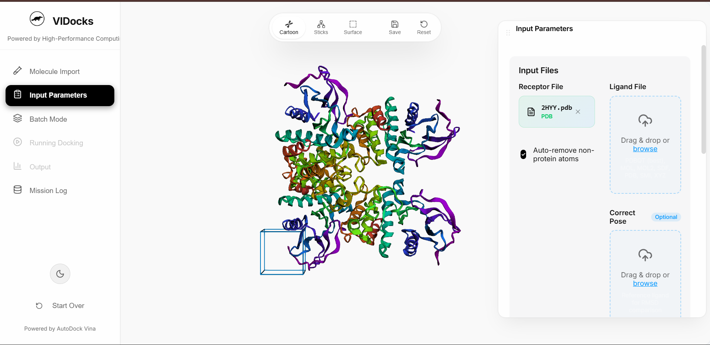

https://zenodo.org/records/20131699
# VIDocks Pro 🧬
**High-Performance Cloud-Powered Molecular Docking Platform**

🚀 **Live URL:** [https://vidocks.vercel.app](https://vidocks.vercel.app)



VIDocks is a professional molecular docking platform featuring a beautiful glassmorphism UI, real-time 3D visualization, and powerful batch docking capabilities. It streamlines the drug discovery workflow by providing an intuitive interface for AutoDock Vina.


---

## ✨ Features

- 🔬 **Local/Cloud Backend** — High-performance docking via FastAPI + AutoDock Vina
- 🎨 **Beautiful UI** — Stunning floating panels, dark and light mode, and a spatial glassmorphism design
- 🧬 **Interactive 3D Viewer** — Cartoon, Sticks, and Surface representation modes using 3Dmol.js
- ⚡ **Batch Docking** — High-throughput screening for library validation
- 💾 **Mission Logs** — Save and manage docking projects offline using IndexedDB

---

## 📖 Basic Usage

1.  **Launch**: Open the [Live App](https://vidocks.vercel.app) or run locally.
2.  **Import Receptor**: Enter a PDB ID (e.g., `1hsg`) or upload your own `.pdb`/`.pdbqt` file.
3.  **Import Ligand**: Search by PubChem name/CID or upload a `.sdf`/`.mol2`/`.pdbqt` file.
4.  **Configure**: Adjust the **Grid Box** coordinates to target the active site.
5.  **Dock**: Click **Run Docking**. The results will be visualized in the 3D viewer, showing the best-fit poses and binding affinities.

---


To run the entire platform, you need to start **both** the Backend API and the Frontend Development Server.
You can do this by using two separate Terminal tabs in VS Code.

### Terminal 1: Start the Backend (FastAPI)
1. Open a new terminal in VS Code (`Ctrl + \``).
2. Navigate to the `backend` folder:
   ```bash
   cd "d:\USER\SIMDOCK\simdock-pro\backend"
   ```
3. Run the API startup script:
   ```bash
   .\run_api_clean.bat
   ```
   > **Note:** This batch script will automatically search for your Python/Miniconda installation and start the FastAPI server on `http://127.0.0.1:8000`. Leave this terminal tab running.

### Terminal 2: Start the Frontend (React + Vite)
1. Open a **second** terminal tab in VS Code (click the `+` icon in the terminal panel).
2. Ensure you are in the root `simdock-pro` folder:
   ```bash
   cd "d:\user\SIMDOCK\simdock-pro"
   ```
3. Install the Node dependencies (only needed the first time):
   ```bash
   npm install
   ```
4. Start the frontend development server:
   ```bash
   npm run dev
   ```
5. **Open in Browser:** `Ctrl+Click` (or `Cmd+Click` on Mac) the local URL shown in your terminal, usually `http://localhost:5173`.

---

## 🛠️ Technology Stack

| Component | Tech |
| :--- | :--- |
| **Frontend Framework** | React 19 + TypeScript + Vite |
| **UI Styling** | Custom CSS Variables, Glassmorphism & Animations |
| **State Management** | Zustand |
| **3D Rendering** | 3Dmol.js & Three.js (Background Grid) |
| **Backend API** | FastAPI, Uvicorn, Python |
| **Docking Engine** | AutoDock Vina |
| **Data Storage** | IndexedDB via `idb` package |

---

## 📁 Directory Structure

``` text
simdock-pro/
├── backend/         # Python FastAPI Backend & AutoDock Vina integrations
│   ├── api/         # FastAPI routes and endpoints
│   ├── core/        # Docking logic and dependencies
│   ├── run_api_clean.bat  # Startup script for the backend API
│   └── main.py      # Standalone GUI launcher (alternative to browser)
├── src/
│   ├── core/        # Frontend types and interfaces
│   ├── services/    # API calls to the backend and project offline storage
│   ├── store/       # Zustand global state (dockingStore & userStore)
│   ├── ui/          # UI Components & Stylesheets
│   │   ├── components/ # Reusable UI pieces (Floating panels, Sidebar)
│   │   └── styles/     # Component-specific CSS
│   ├── utils/       # Gridbox calculators and helpers
│   ├── App.tsx      # Main application layout
│   └── main.tsx     # React Entry point
├── public/          # Static assets (3Dmol.js script)
├── README.md        # You are here!
└── package.json     # Node Dependencies
```

---

## 🤝 Contributing
Contributions, issues, and feature requests are welcome!

## 📄 License
MIT License.
